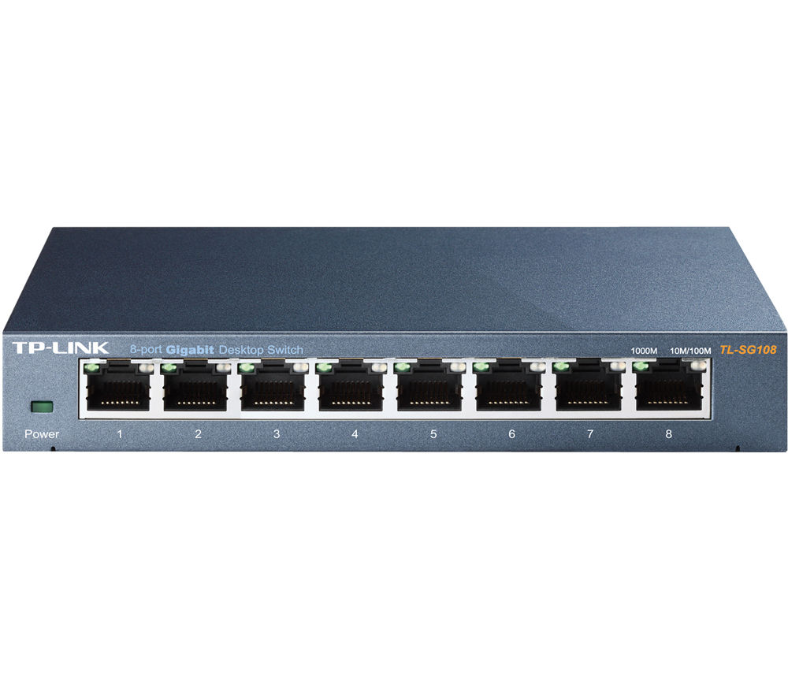

# Introduction to Quark
Quark is a cluster computing flow. 'Flow' meaning that it describes how to use cluster computing with Python, and the concepts behind it.

**Objective:** Use multiple ARM-based computers to calculate pi in parallel to the highest amount of digits in 60 minutes.

Although the main objective is above, Quark also will be here for other students or users to learn and use parallel computing.

# Concepts

## How cluster computing works
Cluster computing is a type of computing in which a group of computers are linked together so that they can act like a single computer.

There are **two** types of computers in a cluster. A *controller*, which distributes the tasks and controlls the cluster and *workers*, which do what they say on the tin, carry out the task.
Controllers are sometimes called master nodes or governing nodes. 
A computer in a cluster is known as a **node** whether it is a controller or worker.

Tasks are distributed evenly across the nodes so that they can be ran with multiple processors. Tasks also have to be written and designed in a certain way that uses the cluster. 

Our nodes will run [Ubuntu Server](https://ubuntu.com/download/server) as the operating system and use [Python](https://www.python.org) as the high-level language that we will write the tasks in. 

## Visualisation of cluster computing

# Calculating primes in parallel

## Introduction 
prime.py is a Python task that calculates prime numbers up to a certain endpoint over a single or multiple processors in parallel. This was written as the first milestone test for Quark. It enables me to then move on to researching solutions to the final objective of calculating pi in parallel.

## Dependencies
- mpi4py
- time
- sys

## How prime.py works
The following steps show how the method of working the prime numbers out works, not Quark.  

1.	task works out its rank in the Quark cluster and works out which part of the range of numbers or candidates it needs to check for prime numbers.
2.	for loop goes through range of candidates...
3.	assumes the candidate is a prime
4.	goes through previous candidates and see if they divide without remainder, if so break loop
5.  if we get here, it is a prime number, add to primes array, else go to next candidate
6.	once complete, send results to the controller
7.	if processor is controller, show results

# Calculating Pi in parallel

# Build and Test

## Building a cluster with Raspberry Pi 4s

**Note:** If you have a cluster already setup with Ubuntu Server 18.04.4 LTS or later and an active internet connection, you can skip to [node setup](/docs/nodesetup.md).

### You'll need
- 2x [Raspberry Pi 4s](https://www.raspberrypi.org/products/raspberry-pi-4-model-b/)
- A [cluster case](https://www.amazon.co.uk/gp/product/B07TLSVTQP/)
- An [ethernet switch](https://www.amazon.co.uk/NETGEAR-Gigabit-Ethernet-Unmanaged-GS105UK/dp/B0000E5SEQ)
- [Multi-port USB PSU](https://www.anker.com/uk/products/variant/powerport-5/A2124211)
- 4x [USB-C Cables](https://www.amazon.co.uk/gp/product/B07PPM7HLR/)
- 4x [Gigabit Ethernet Cables](https://shop.pimoroni.com/products/cat5e-utp-ethernet-cable?variant=2664981953)

A cluster of Raspberry Pis can start with as little as two and grow into hundreds. We'll use a modest two though in this example Each one, known as a ‘node’, will carry out part of our task for us and they all work in parallel to produce the result a lot quicker than a single node ever could. Some nice ‘cluster cases’ are available. 

We start here by assembling our Raspberry Pi 4B computers into a four-berth chassis. Many different configurations are available, including fan cooling. These guides work with other Raspberry Pis as well.

> A dedicated inexpensive switch will speed up communications. Raspberry Pi 4 computers can take advantage of full-bandwidth Gigabit Ethernet

Consider the power requirements for your cluster. With our four nodes it’s not going to be ideal to have four PSUs driving them. As well as being ugly, it’s inefficient. Instead, track down a good-quality, powerful multi-port USB charger that is capable of powering your chosen number of computers. Then all you need are the cables to link them and you’re using a single mains socket. USB units are available that can handle eight Raspberry Pi computers without breaking a sweat. Do be careful of the higher demands of Raspberry Pi 4. 

A cluster works by communication. A controller node is in charge of the cluster and the workers are told what to do and to report back the results on demand. To achieve this we’re using wired Ethernet on a dedicated network. It’s not essential to do it this way, but for data-intensive applications it’s advisable for the cluster to have its own private link-up so it can exchange instructions without being hampered by wireless LAN or other network traffic.

### Getting setup
1) For each node, burn [Ubuntu Server 18.04.4 LTS](https://ubuntu.com/download/server) to a microSD card.
2) To setup each node, follow [these instructions](/docs/nodesetup.md).

## Building a simulated cluster

So you don't have multiple RPis lying around. That's fine, we can virtualise a cluster with Virtual Machines. 

A virtual machine is a file, typically called an image, that behaves like an actual computer. In other words, creating a computer within a computer. It runs in a window, much like any other program, giving the end user the same experience on a virtual machine as they would have on the host operating system itself. The virtual machine is sandboxed from the rest of the system, meaning that the software inside a virtual machine can’t escape or tamper with the computer itself. Multiple virtual machines can run simultaneously on the same physical computer.

### Let's get started...

1) [Install VirtualBox](https://www.virtualbox.org/wiki/Downloads) for your system (Supports Windows, MacOS, Linux & Solaris). Follow the installer instructions to install it.
2) [Download the Ubuntu Server 18.04.4 LTS image](https://ubuntu.com/download/server)  
3) Open VirtualBox and click **New**. We'll set up the *controller* node first.
4) Enter *simpy-controller* as the name, then select *Linux* as the type and *Ubuntu 64bit* as the version .
5) For all the following prompts, just click *continue* or *create* on each (unless you want custom settings). You'll be taken to  *memory size* , then *hard disk*  all the way back to the main screen where you have created the VM. 
6) Click **Start**.
7) Select the .iso file you downloaded from the Ubuntu website in the pop-up then click **Start**.
8) Follow the instructions on-screen to install the Ubuntu Server OS. When you create credentials, make sure **your server's name** is *simpy-controller*. When you get to the Install OpenSSH screen, select it and continue to install the system with default settings. It will download security updates, then press enter when it prompts for a reboot.
9) The VM will reboot, then press enter when it asks you to remove the boot medium/device.

### The next steps...
Congrats, you've set up the controller VM! 
To create the worker node, repeat the previous steps from step **3**, just changing the parts where you entered *simpy-controller* to *simpy-worker1*. 

### Cluster assemble!
Now we need to get our virtual cluster set up with Quark. 

1) Start both the *simpy-controller* and *simpy-worker1* machines. Log into both with the username and password you created.
The following steps need to be done on both nodes.
2) In the menu bar, go to **Devices > Network > Network Settings** and select from the dropdown **Bridged Adapter**. 

### Setting up each node

To setup each node, follow [these instructions](/docs/nodesetup.md).