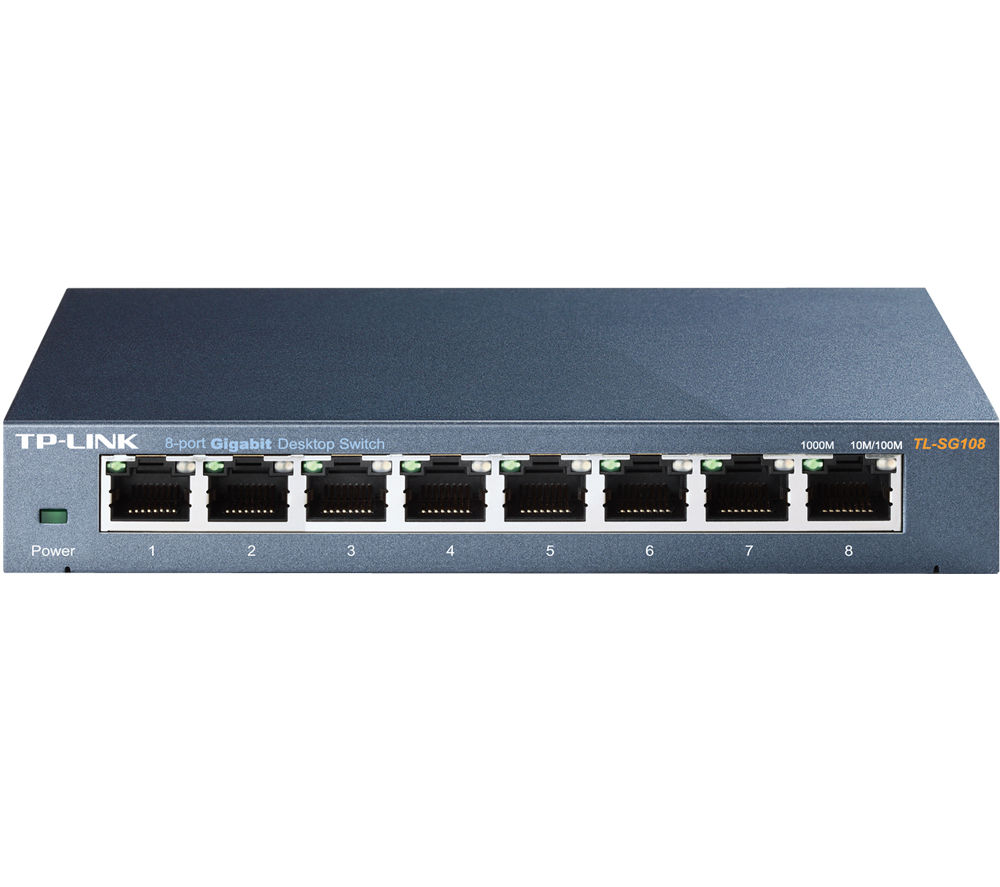

## Building a cluster with Raspberry Pi 4s

**Note:** If you have a cluster already setup with Ubuntu Server 18.04.4 LTS or later and an active internet connection, you can skip to [node setup](/docs/nodesetup.md).

### You'll need
- 2x [Raspberry Pi 4s](https://www.raspberrypi.org/products/raspberry-pi-4-model-b/)
- A [cluster case](https://www.amazon.co.uk/gp/product/B07TLSVTQP/)
- An [ethernet switch](https://www.amazon.co.uk/NETGEAR-Gigabit-Ethernet-Unmanaged-GS105UK/dp/B0000E5SEQ)
- [Multi-port USB PSU](https://www.anker.com/uk/products/variant/powerport-5/A2124211)
- 4x [USB-C Cables](https://www.amazon.co.uk/gp/product/B07PPM7HLR/)
- 4x [Gigabit Ethernet Cables](https://shop.pimoroni.com/products/cat5e-utp-ethernet-cable?variant=2664981953)

A cluster of Raspberry Pis can start with as little as two and grow into hundreds. We'll use a modest two though in this example Each one, known as a ‘node’, will carry out part of our task for us and they all work in parallel to produce the result a lot quicker than a single node ever could. Some nice ‘cluster cases’ are available. 

We start here by assembling our Raspberry Pi 4B computers into a four-berth chassis. Many different configurations are available, including fan cooling. These guides work with other Raspberry Pis as well.

> A dedicated inexpensive switch will speed up communications. Raspberry Pi 4 computers can take advantage of full-bandwidth Gigabit Ethernet

Consider the power requirements for your cluster. With our four nodes it’s not going to be ideal to have four PSUs driving them. As well as being ugly, it’s inefficient. Instead, track down a good-quality, powerful multi-port USB charger that is capable of powering your chosen number of computers. Then all you need are the cables to link them and you’re using a single mains socket. USB units are available that can handle eight Raspberry Pi computers without breaking a sweat. Do be careful of the higher demands of Raspberry Pi 4. 

A cluster works by communication. A controller node is in charge of the cluster and the workers are told what to do and to report back the results on demand. To achieve this we’re using wired Ethernet on a dedicated network. It’s not essential to do it this way, but for data-intensive applications it’s advisable for the cluster to have its own private link-up so it can exchange instructions without being hampered by wireless LAN or other network traffic.

### Getting setup
1) For each node, burn [Ubuntu Server 18.04.4 LTS](https://ubuntu.com/download/server) to a microSD card.
2) To setup each node, follow [these instructions](/docs/nodesetup.md).